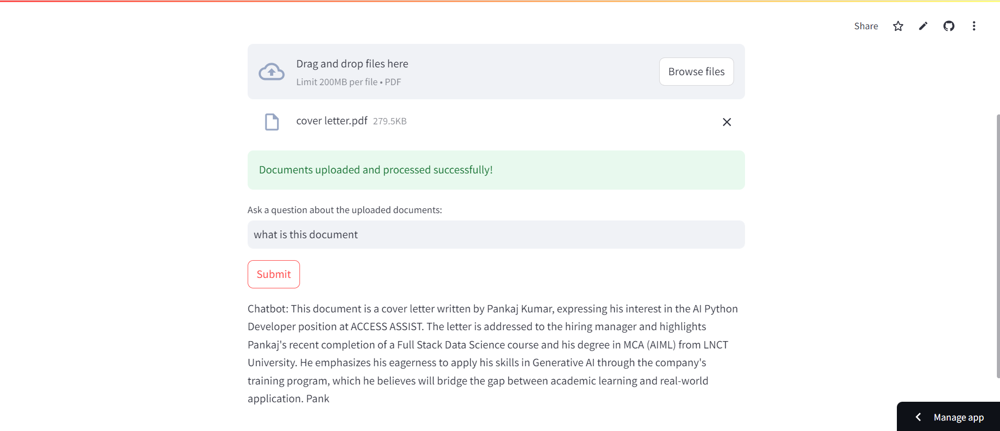

# Interactive QA Bot

An interactive question-answering bot that allows users to upload PDF documents and ask questions about their content. This application uses Cohere for text embeddings and Qdrant for vector storage and retrieval.

## Features

- **PDF Upload**: Upload multiple PDF documents for processing.
- **Vector Storage**: Store embedded text vectors in Qdrant for efficient search and retrieval.
- **Natural Language Processing**: Use Cohere's API to generate embeddings and responses based on user queries.
- **Interactive UI**: A simple and user-friendly interface built with Streamlit.

## Requirements

To run this application, you'll need:

- Python 3.7 or higher
- Streamlit
- PyPDF2
- Qdrant Client
- Cohere Client

You can install the required packages using pip:

```bash
pip install -r requirements.txt
```

## Setup
1. Create your account on Qdrant and cohere and copy the API from both of them.
    https://qdrant.tech/
    https://cohere.com/
2. Change the api in the file app.py 
3. Start the Streamlit Application
```bash
    git clone https://github.com/pankaj7322/Interactive-QA-Bot-using-RAG-and-Qdrant.git
    cd Interactive-QA-Bot-using-RAG-and-Qdrant
    streamlit run app.py
```
## Usage
1. Click on Reset Collection to initialize the storage
2. Upload PDF files using the file uploader
3. Enter your question in the next input box and click Ask to get answer based on the Uploaded documents.

## Deploy Website
    https://interactive-chatbot.streamlit.app/
## Screenshot


